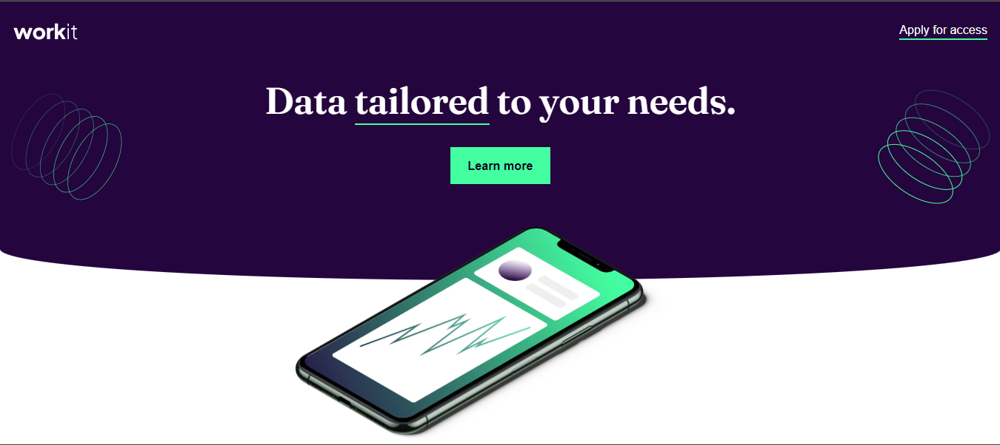

# Work Landing Page

Landing page criada com o objetivo de melhorar a apresentação dos produtos do site.

## 🧠 Tecnologias utilizadas
- HTML  
- CSS  

## 🚀 Funcionalidades
- Layout totalmente responsivo para diferentes tamanhos de tela.  

## 🧩 Aprendizados
Durante o desenvolvimento, foram praticados conceitos importantes de:
- Flexbox  
- Displays  
- Containers  
- HTML semântico  
- Seletores de tag  

## 🌐 Demonstração
[Link do site — adicionar depois]

## 🖼️ Captura de tela

## 👨‍💻 Autor
**Arthur Roberto**  
[GitHub](https://github.com/arthurroberto)

---

Projeto desenvolvido para treinar boas práticas de HTML e CSS, com foco em estruturação e layout responsivo.
